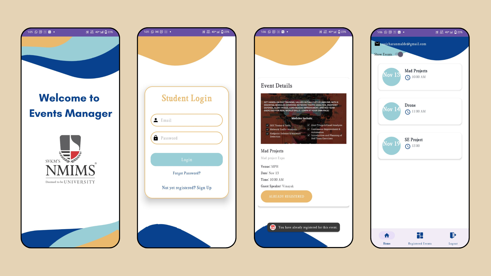

# Events Manager Mobile App

## 📌 Overview
The **Event Manager Mobile App** is an Android application designed to simplify event creation, management, and participation. Built using **Java**, it leverages **Firebase Firestore** for database management and **Firebase Cloud Messaging (FCM)** for real-time notifications.

---

## 🚀 Features
✅ User Authentication (Sign Up / Login via Firebase Auth)
✅ Create, Edit, and Delete Events
✅ Admin Control
✅ RSVP & Attendee Tracking
✅ Real-time Event Updates via Push Notifications
✅ Calendar Integration for Seamless Scheduling
✅ Modern & Intuitive UI

---

## 🛠️ Installation Guide
### Prerequisites
- **Android Studio** (Latest Version)
- **Java (JDK 11 or higher)**
- **Firebase Project** (Configured with Firestore and FCM)

### Steps to Install
1. **Clone the Repository:**
   ```bash
   git clone https://github.com/your-repo/Event-Manager-Mobile-App.git
   ```
2. **Open the project in Android Studio.**
3. **Sync Dependencies using Gradle.**
4. **Configure Firebase:**
   - Add `google-services.json` to the `app/` directory.
   - Enable Firestore and Firebase Authentication.
   - Set up Firebase Cloud Messaging (FCM).
5. **Run the Project on an Emulator or Physical Device.**

---

## 📲 How to Use
1. **Sign Up/Login** using Firebase Authentication.
2. **Browse or Create Events** with detailed descriptions and images.
3. **RSVP to Events** and get real-time updates.
4. **Receive Notifications** for event changes, reminders, and announcements.
5. **Easily Manage Your Events** from the dashboard.

---

## 🏗️ Tech Stack
- **Language:** Java (Android)
- **Database:** Firebase Firestore
- **Authentication:** Firebase Authentication
- **Push Notifications:** Firebase Cloud Messaging (FCM)
- **UI Framework:** XML with Material Design Components

---

## 🤝 Contributing
Want to improve this project? Follow these steps:
1. **Fork the Repository.**
2. **Create a New Branch (`feature-branch-name`).**
3. **Commit Your Changes.**
4. **Submit a Pull Request.**

---

## 📜 License
This project is licensed under the **MIT License**. See `LICENSE` for more details.

---

## 📧 Contact & Support
For any queries or contributions, feel free to reach out:
